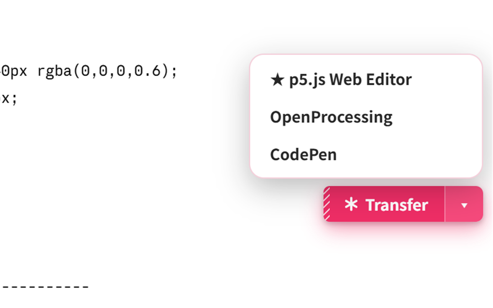
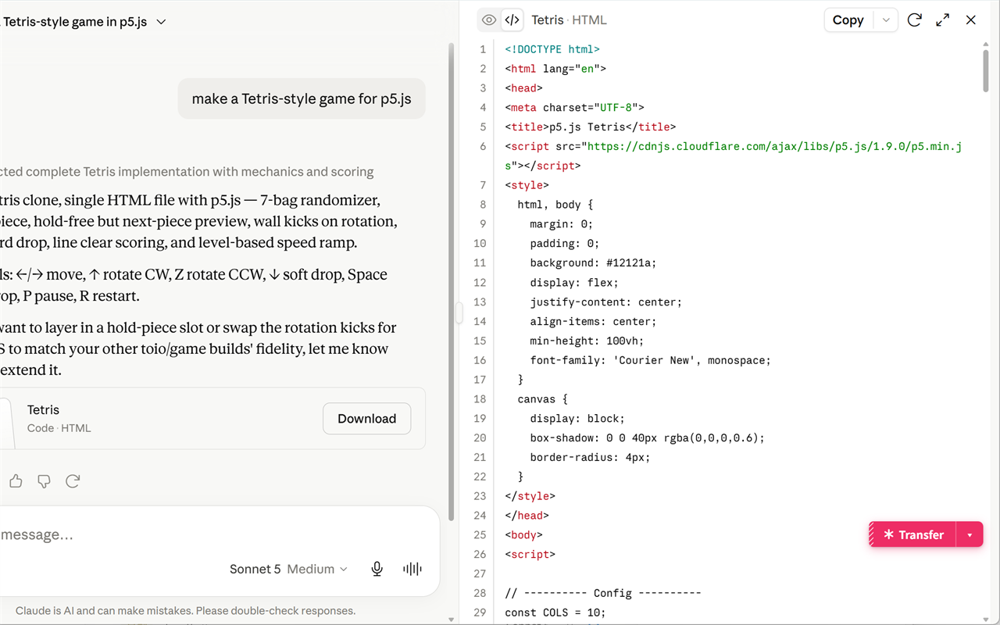
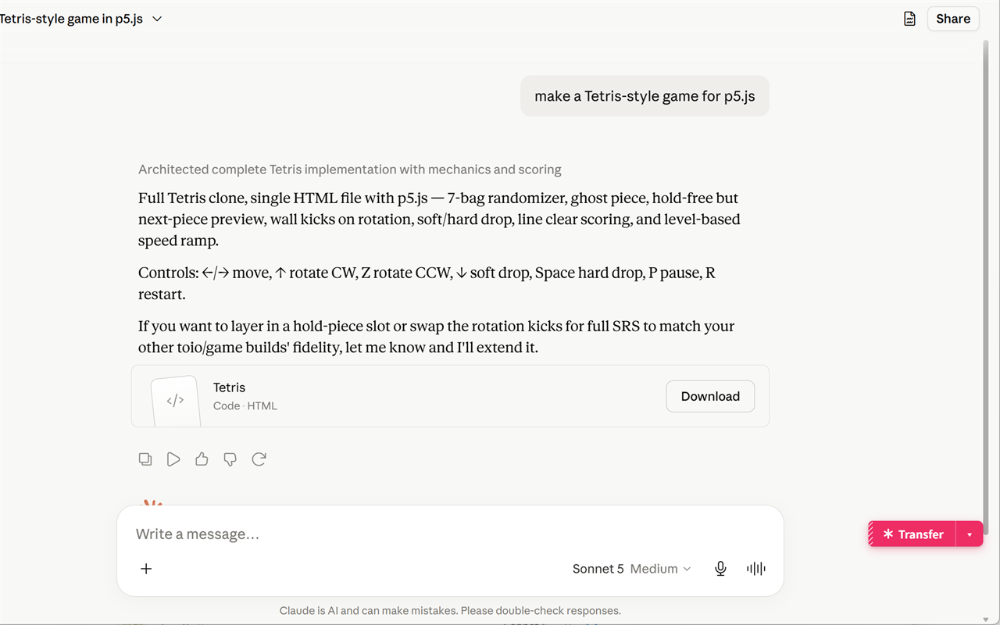
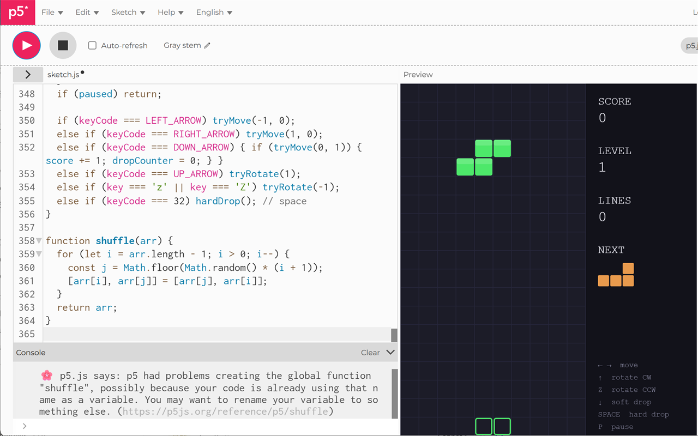
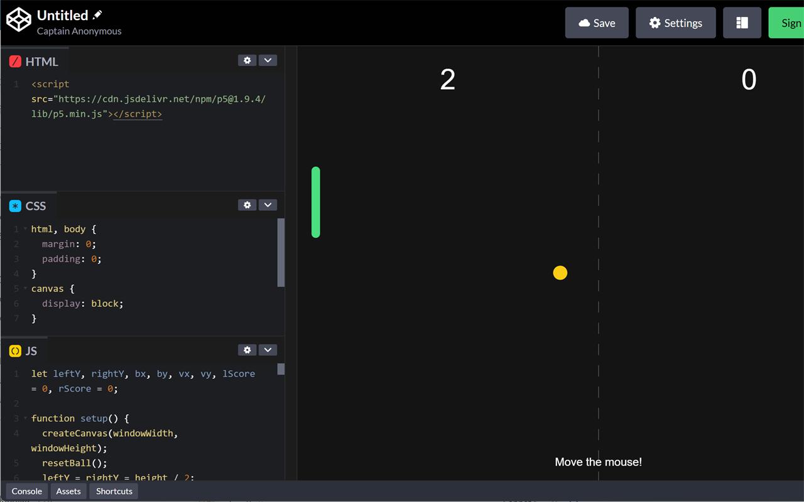
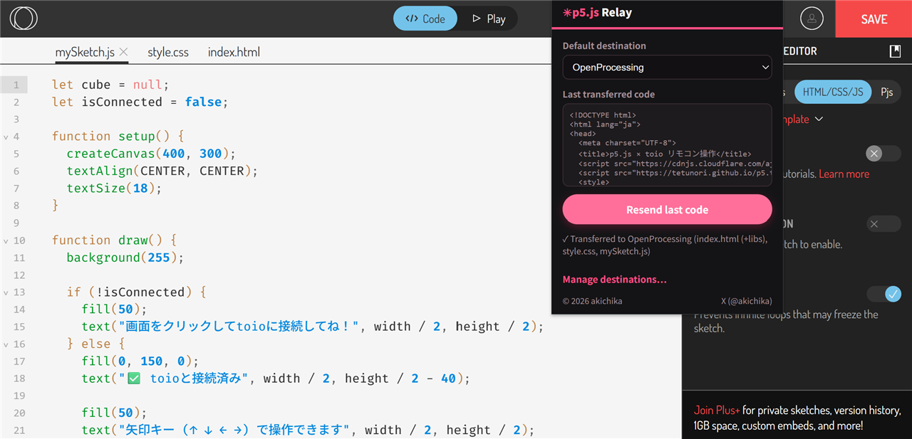
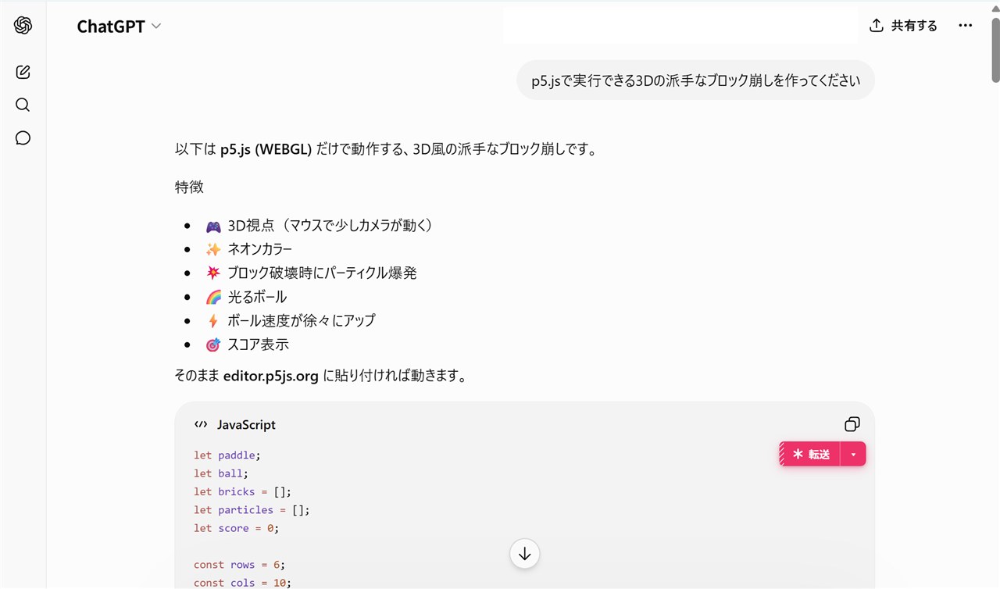
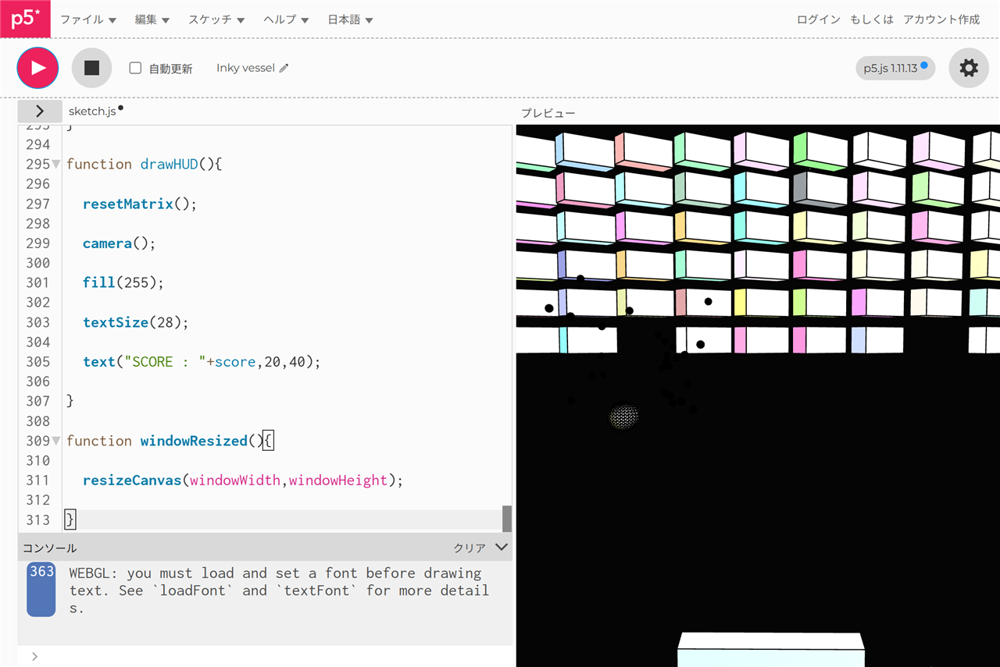
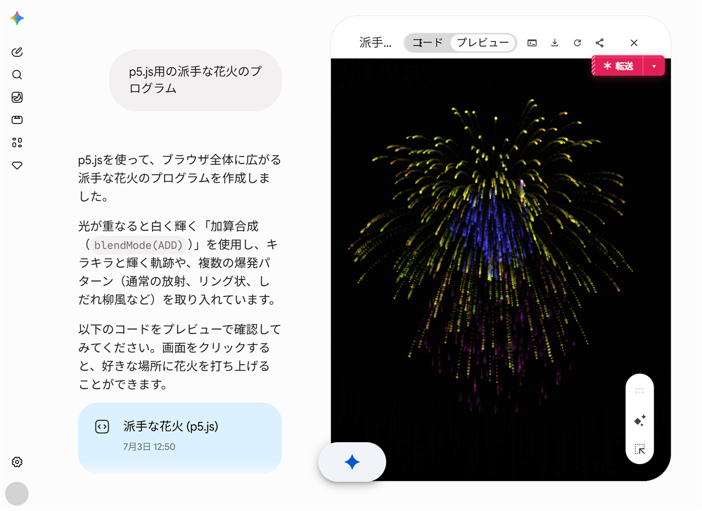
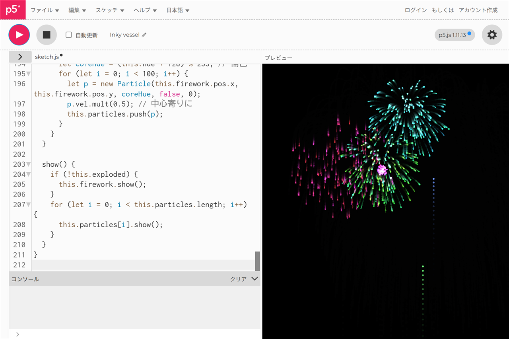

# ✳ p5.js Relay

[English](README.en.md) | 日本語

Claude / ChatGPT / Gemini で生成されたコードを p5.js Web Editor 等へ簡単転送。バイブコーディングなどの用途に。

Chrome / Microsoft Edge（Chromium系ブラウザ）対応の拡張機能（Manifest V3）です。単一HTMLは **index.html / style.css / sketch.js に自動振り分け**して貼り付けます。

- リポジトリ: https://github.com/akichika/p5js-relay
- Issue報告・Pull Requestは上記リポジトリへどうぞ

## スクリーンショット

| | |
|---|---|
|  |  |
| ChatGPT/Claudeのコードブロックに表示される「✳ 転送」ボタンと送信先メニュー | Artifactパネルからも同じボタンで転送可能 |
|  |  |
| パネルを閉じていても使える常設フローティングボタン(FAB) | p5.js Web Editorへワンタッチで反映 |
|  |  |
| CodePenへはHTML/CSS/JSパネルに自動振り分け | OpenProcessingは「HTML/CSS/JS」モードを選択したうえで転送すると、mySketch.js / style.css / index.htmlの3ファイルに自動で振り分けて貼り付けます |
|  |  |
| ChatGPTで生成したコードも「✳ 転送」ボタン一つでp5.js Web Editorへ | コピー&ペーストを挟まずそのまま実行できる |
|  |  |
| Geminiで生成したコードも同様に転送可能 | コピー&ペーストを挟まずそのまま実行できる |

## インストール（開発者モード）

### Chrome
1. このフォルダを任意の場所に置く
2. Chromeで `chrome://extensions` を開く
3. 右上の「デベロッパーモード」をON
4. 「パッケージ化されていない拡張機能を読み込む」→ このフォルダを選択

### Microsoft Edge
1. このフォルダを任意の場所に置く
2. Edgeで `edge://extensions` を開く
3. 左下の「開発者モード」をON
4. 「展開して読み込み」→ このフォルダを選択

（EdgeはChromium系ブラウザのため、Chrome拡張機能をそのまま読み込めます。`chrome.*` APIはEdgeでも同様に動作します。）

## 使い方

1. AIチャットのコードブロック / Canvas / Artifactパネルに「✳ 転送」ボタンが表示されます
2. クリックで既定の送信先へワンタッチ反映（タブが無ければ自動で開きます）
3. 「▾」で送信先を選択、右クリックメニューからの選択テキスト送信も可

## ファイル振り分け（マルチファイル反映）

Canvas等が生成した単一HTMLを解析し、送信先の方式に合わせて振り分けます。

**共通の分割:** インライン`<style>`→CSS、インライン`<script>`→JS、外部`<script src>`(CDNライブラリ)と外部`<link rel="stylesheet">`(フォント等)は「ライブラリ」として抽出。JSがp5スケッチ(setup/draw)なのにp5読込が無ければCDNを自動補完します。

**送信先ごとの反映方式（振り分け=splitMode）:**

| 方式 | 対象 | 動作 |
|---|---|---|
| `tabs` + merge | p5.js Web Editor | style.css / sketch.js タブへ反映。**index.htmlは置き換えず**、既存内容を読み取って不足しているライブラリタグ(p5標準以外のCDNやフォント)だけを`</head>`直前に差し込みます。エディタ標準のp5読込を壊しません |
| `tabs` + merge | OpenProcessing | 複数ファイル転送時はSKETCHパネルの**MODEを「HTML/CSS/JS」に自動切替**し、mySketch.js / style.css / index.html の3タブへ反映。index.htmlはp5.jsと同様にライブラリ差し込み方式(失敗時は全置換フォールバック)。JSのみの転送ではモードを変更しない |
| `panels` | CodePen | HTMLパネルに「ライブラリscriptタグ + body内容」、CSSパネルにCSS、JSパネルにJSを、パネルセレクタ(`#box-*`)で反映 |
| `off` | 任意 | 分割せずそのまま反映 |

- 純粋なJSのみ / CSSのみの入力は該当ファイルにそのまま反映します
- 制限: 生成HTMLのbody内に必須DOM要素がある場合、merge方式ではindex.htmlに手動追加が必要なことがあります(ライブラリのみ自動差し込みのため。差し込み失敗時の全置換フォールバックではbodyも入ります)
- JSFiddleは貼り付けが安定しないため対応を終了しました(v2.1.3)

## 設定

- **テーマ**: システム（既定）/ ライト / ダーク をオプションページで選択
- **言語**: システム言語に自動追従。対応言語は英語・日本語・中国語（簡体字/繁体字）・韓国語・スペイン語・フランス語・ドイツ語・ポルトガル語（ブラジル）・ロシア語の10言語（非対応言語は英語にフォールバック）
- **エディタ種別**: `auto`（推奨・CM5→CM6→Monaco→Ace→textarea→contenteditableの順に自動判別）ほか固定指定も可。固定指定でも5秒見つからなければautoにフォールバック
- **貼り付けモード**: 置き換え（既定）/ 末尾追記
- **About**: オプションページ下部にGitHubリポジトリ（Issue/Pull Request）とXアカウントへのリンクを表示

## 対応サイト

- 送信元: claude.ai / chatgpt.com / chat.openai.com / gemini.google.com（Canvas対応）/ aistudio.google.com
- 送信先プリセット: p5.js Web Editor / OpenProcessing / CodePen（オプションで自由に追加可能）

## 仕組み

- 送信元コンテンツスクリプトが `pre` 要素とCanvasパネル(Shadow DOM対応)を監視してボタンを付与
- Service Workerが単一HTMLを正規表現で分割（SWにはDOMParserが無いため）
- `chrome.scripting.executeScript` の **MAINワールド実行**で、送信先ページ内の CodeMirror / Monaco / Ace のAPIを直接叩いて反映。マルチファイル時はファイルタブをクリックイベントで切り替えつつ順次反映
- Canvasからの抽出もMAINワールドでエディタAPIから全文取得（CM6の仮想スクロール対策）

## マーケットプレイス公開

- `PRIVACY.md`: プライバシーポリシー(日英) — GitHub Pages等で公開してストアに登録
- `store-listing.md`: ストア掲載文(日英)・単一用途説明・権限理由・公開手順チェックリスト（Chrome Web Store / Microsoft Edge Add-ons 両対応）
- `p5js-relay-store-vX.Y.Z.zip`: ストアアップロード用(manifest.jsonがzip直下)

## Issue / Pull Request

不具合報告・機能要望・Pull Requestは GitHub リポジトリで受け付けています。

- Issues: https://github.com/akichika/p5js-relay/issues
- Pull Requests: https://github.com/akichika/p5js-relay/pulls

## ライセンス・作者

MIT License. © 2026 [akichika](https://x.com/akichika)

`lib/` 配下に同梱している p5.js / p5.sound(いずれも LGPL-2.1)は本プロジェクトの
MIT ライセンスの対象外です。詳細は [lib/README.md](lib/README.md) を参照してください。
